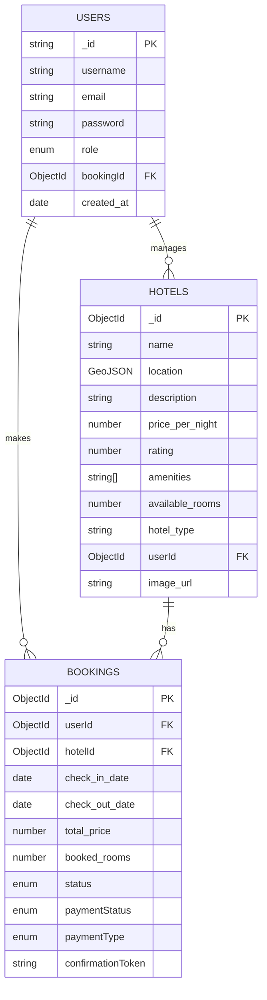

# StayMate Project

## Abstract
StayMate is a comprehensive hotel booking and recommendation platform. It features a robust backend built with NestJS and an AI-powered recommendation service using Python and machine learning. The system allows users to register, book hotels, and receive personalized hotel recommendations based on their preferences and booking history. The modular architecture supports scalability, security, and easy integration with various frontends.

## List of Figures
- System Architecture Diagram *(to be added)*
- Database Schema Diagram *(to be added)*
- Use Case Diagram *(to be added)*
- Data Flow Diagram *(to be added)*

---

## Chapter 1: **Introduction**
### 1.1 Problem Specification/Statement
Finding the right hotel that matches user preferences and budget is challenging. StayMate aims to simplify this by providing a seamless booking experience and AI-driven recommendations, addressing the gap in personalized hotel search and management.

### 1.2 Objectives
- Enable users to search, book, and manage hotel reservations.
- Provide personalized hotel recommendations using AI.
- Support admin and manager roles for hotel management.
- Ensure secure authentication and authorization.
- Offer scalable and maintainable architecture.

### 1.3 Flow of the Project
1. User registration and login.
2. Hotel search and booking.
3. AI-based recommendations.
4. Admin/manager hotel management.
5. Data-driven improvements and analytics.

### 1.4 Organization Of Project Report
This document covers system background, design, implementation, user manual, and future work, providing a holistic view of the StayMate platform.

---

## Chapter 2: **Background**
### 2.1 Existing System Analysis
Traditional hotel booking platforms often lack personalized recommendations and seamless management for different user roles. StayMate addresses these limitations by integrating AI and role-based access control.

### 2.2 Supporting Literatures
- [NestJS Documentation](https://docs.nestjs.com)
- [Flask Documentation](https://flask.palletsprojects.com/)
- [Transformers](https://huggingface.co/transformers/)
- [MongoDB](https://www.mongodb.com/)
- Research on recommender systems and user personalization

---

## Chapter 3: **System Analysis & Design**
### 3.1 Technology & Tools
- **Backend:** NestJS (Node.js, TypeScript)
- **AI Service:** Python (Flask, PyTorch, Transformers)
- **Database:** MongoDB
- **Other:** Docker, Vercel, AWS S3, Pandas, Scikit-learn

### 3.2 Model & Diagram
#### 3.2.1 Model (SDLC/Agile/Waterfall/OOM)
Agile methodology with modular design for scalability and rapid iteration. Each module (auth, hotels, bookings, recommendations, AI) is independently testable and deployable.

#### 3.2.2 Use Case Diagram
- **User:** Register, login, search hotels, book hotels, view recommendations
- **Admin:** Manage hotels, view all bookings, manage users
- **Manager:** Add/update/delete hotels, manage bookings
- **AI Service:** Generate personalized recommendations

#### 3.2.3 Context Level Diagram
- Users interact with the NestJS API for all operations
- NestJS API communicates with MongoDB and the AI service
- AI service processes user and hotel data to return recommendations

#### 3.2.4 Data Flow Diagram
- User submits booking/preferences → API → AI Service → Recommendations
- Admin/Manager actions → API → Database

#### 3.2.5 Database Schema
**Hotels**
- `name`, `location`, `description`, `price_per_night`, `rating`, `amenities`, `available_rooms`, `hotel_type`, `userId`, `image_url`

**Booking**
- `userId`, `hotelId`, `check_in_date`, `check_out_date`, `total_price`, `booked_rooms`, `status`, `paymentStatus`, `paymentType`, `confirmationToken`

**Users**
- `username`, `email`, `password`, `role`, `bookingId`, `created_at`

#### 3.2.6 Algorithms/Flowchart
- **AI Recommendation:** Uses sentence-transformer embeddings and cosine similarity to match user preferences with hotel features.
- **Booking Management:** Ensures room availability, handles payment status, and manages booking lifecycle.
- **Authentication:** JWT-based, with role-based guards for access control.

### Database Schema Design

Below is the Entity-Relationship (ER) diagram for the StayMate platform:



**Explanation:**
- **USERS** can make multiple **BOOKINGS** (one-to-many).
- **HOTELS** can have multiple **BOOKINGS** (one-to-many).
- **USERS** (with manager/admin role) can manage multiple **HOTELS** (one-to-many).
- Each **BOOKING** references a single **USER** and a single **HOTEL**.

---

## Chapter 4: **Implementation**
### 4.1 Interface Design/Front-End
*(Not included in this repo; API-first design for easy integration with any frontend such as React, Angular, or mobile apps.)*

### 4.2 Back-End
- **NestJS API:** Handles authentication, hotel management, bookings, and recommendations. Modular structure for maintainability.
- **AI Service:** Flask app for hotel recommendations using ML models. Embeds hotel and user preferences, computes similarity, and returns top matches.

### 4.3 Modules
- **Auth:** User registration, login, JWT-based authentication, role management (User, Manager, Admin).
- **Hotels:** CRUD operations, nearby search, admin/manager controls, image upload (S3 integration).
- **Bookings:** Create/view bookings, cron for unconfirmed bookings, user booking history.
- **Recommendations:** Fetch personalized hotel recommendations from the AI service.
- **Database:** MongoDB schemas for users, hotels, and bookings.
- **Email Service:** (If enabled) Sends booking confirmations and notifications.

---

## Chapter 5: **User Manual**
### 5.1 System Requirement
#### 5.1.1 Hardware Requirement
- Modern PC/server, 4GB+ RAM (8GB+ recommended for AI service with GPU support).
- Sufficient disk space for MongoDB and model files.

#### 5.1.2 Software Requirement
- Node.js (v18+), Python 3.8+, MongoDB, pip, yarn/npm
- (Optional) CUDA-enabled GPU for faster AI inference

### 5.2 User Interfaces
#### 5.2.1 Panel A: User
- Register/login via `/auth/register` and `/auth/login`
- Search and book hotels via `/hotels` and `/bookings`
- View recommendations via `/recommendations/:userId`
- View booking history

#### 5.2.2 Panel B: Admin/Manager
- Add/update/delete hotels via `/hotels` endpoints
- View all bookings via `/bookings` endpoints
- Manage users (admin only)

#### 5.2.3 Login Credentials
- Register via `/auth/register` (Nest API)
- Login via `/auth/login` (Nest API)
- JWT token required for protected endpoints (pass in `Authorization: Bearer <token>` header)

#### 5.2.4 Example API Usage
- **Register:** `POST /auth/register` `{ username, email, pass, role }`
- **Login:** `POST /auth/login` `{ email, pass }`
- **Create Hotel:** `POST /hotels/create` (Manager/Admin only)
- **Book Hotel:** `POST /bookings/create` (User only)
- **Get Recommendations:** `GET /recommendations/:userId`

---

## Chapter 6: **Conclusion**
### 6.1 Conclusion
StayMate provides a scalable, modular hotel booking and recommendation platform with modern backend and AI technologies. Its architecture supports future enhancements and easy integration with various frontends.

### 6.2 Limitation
- No frontend included (API only)
- AI recommendations depend on data quality and volume
- Payment gateway integration not included

### 6.3 Future Works
- Add frontend (web/mobile)
- Enhance AI with more user data and advanced models
- Integrate payment gateways
- Add analytics and reporting modules
- Expand to other domains (e.g., travel packages)

---

## References
- [NestJS Documentation](https://docs.nestjs.com)
- [Flask Documentation](https://flask.palletsprojects.com/)
- [Transformers](https://huggingface.co/transformers/)
- [MongoDB](https://www.mongodb.com/)
- [PyTorch](https://pytorch.org/)
- [Scikit-learn](https://scikit-learn.org/)

---

## **Setup Instructions**

### 1. Clone the repository
```bash
git clone <repo-url>
cd staymate
```

### 2. Install and Run NestJS API
```bash
cd "Nest API"
yarn install
yarn start:dev
```

### 3. Install and Run AI Service
```bash
cd "../AI service"
pip install -r requirements.txt
python app.py
```

### 4. Environment Variables
- Configure MongoDB URI and JWT secret in Nest API (via `.env` or config service).
- (Optional) Set `HUGGINGFACE_TOKEN` for AI service for model downloads.

### 5. API Endpoints
#### **Nest API**
- `/auth/register` - Register new user
- `/auth/login` - Login and receive JWT
- `/hotels` - List/search hotels
- `/hotels/create` - Add hotel (Manager/Admin)
- `/hotels/:id` - Get hotel details
- `/bookings/create` - Book a hotel
- `/bookings/user/:id` - Get user bookings
- `/recommendations/:userId` - Get recommendations for user

#### **AI Service**
- `/initialize` (POST) - Initialize hotel embeddings (send hotels data)
- `/recommend` (POST) - Get recommendations (send user_id and bookings)

### 6. Database Initialization
- MongoDB collections for users, hotels, and bookings are auto-created on first use.
- Sample data can be generated using scripts in `AI service/services/`.

### 7. User Roles
- **User:** Can search, book, and view recommendations
- **Manager:** Can manage hotels they own
- **Admin:** Full access to all hotels, bookings, and users

### 8. System Architecture
- **NestJS API:** Handles business logic, authentication, and data management
- **AI Service:** Provides recommendations via REST API
- **MongoDB:** Stores all persistent data
- **S3 (optional):** Stores hotel images

---

## Contribution
Pull requests are welcome! For major changes, please open an issue first to discuss what you would like to change.

## License
This project is licensed under the MIT License. 